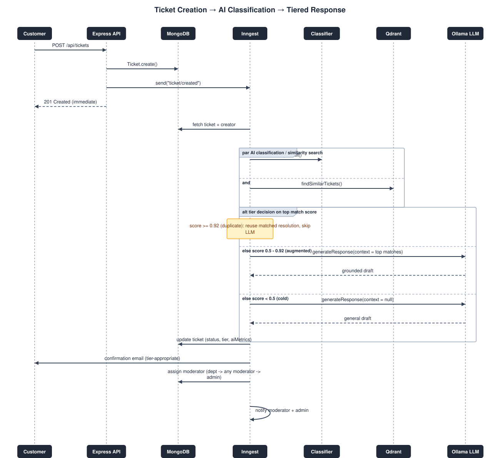
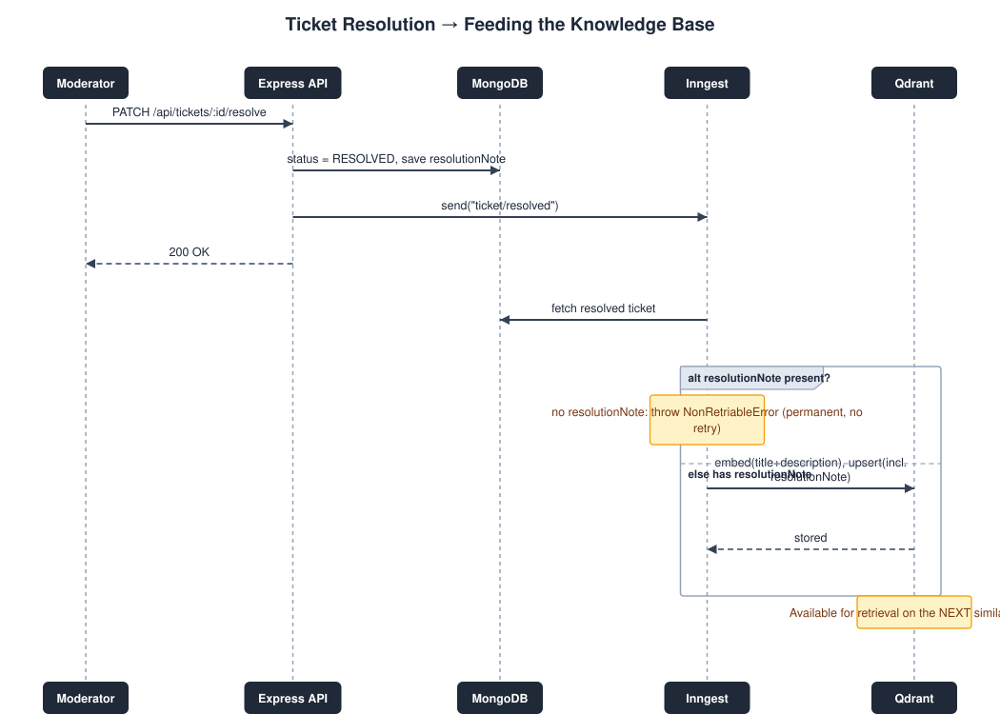
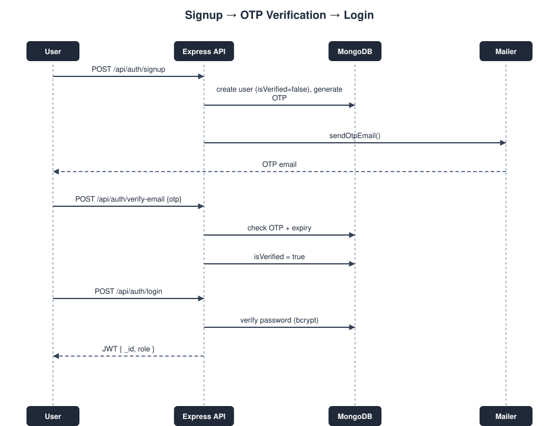

# AI Ticket Automation Platform

An event-driven customer support ticketing system with a hybrid AI pipeline: local zero-shot
classification, a fine-tuned priority model, semantic retrieval over past resolutions
(Qdrant), and confidence-gated local LLM generation (Ollama) for tickets with no strong
historical match.

> This README documents only what is implemented in the current codebase. The
> [Known Limitations](#known-limitations) section is an honest, deliberate call-out list —
> not bugs hidden from the reader.

---

## Live Demo

**Deployed app:** <!-- ADD DEPLOYED LINK HERE -->

> **Note:** The free-tier hosting credits used for the AI model deployment (Ollama) have
> expired. Ticket creation, authentication, classification, and retrieval still run normally
> on the live demo, but LLM-generated draft responses may be unavailable or degraded until
> the model host is reprovisioned. Run the project locally (see [Setup](#setup)) to exercise
> the full pipeline including generation.

---

## Table of Contents
- [Live Demo](#live-demo)
- [Architecture Overview](#architecture-overview)
- [Sequence Diagrams](#sequence-diagrams)
- [Tech Stack](#tech-stack)
- [Core Feature: Tiered Retrieval + Generation](#core-feature-tiered-retrieval--generation)
- [Roles & Access Control](#roles--access-control)
- [Project Structure](#project-structure)
- [Setup](#setup)
- [Environment Variables](#environment-variables)
- [Screenshots](#screenshots)
- [Known Limitations](#known-limitations)

---

## Architecture Overview

```
Customer submits ticket
        │
        ▼
Express API (controllers/ticket.js) — saves ticket, returns immediately
        │
        ▼
Inngest event: "ticket/created"  ──────────────────────────────────────┐
        │                                                              │
        ▼                                                              │
Background pipeline (inngest/functions/on-ticket-create.js):           │
  1. Classify (zero-shot NLI + fine-tuned RoBERTa priority model)      │
  2. Search Qdrant for similar past resolutions                        │
  3. Tier decision: duplicate / augmented / cold                       │
  4. Conditionally call local LLM (Ollama)                             │
  5. Save results, email customer, assign moderator, notify moderator/admin
        │
        ▼
Moderator resolves ticket ──▶ Inngest event: "ticket/resolved"
        │
        ▼
storeResolvedTicket() — embeds problem text, upserts resolution into Qdrant
        │
        ▼
Available for retrieval on the NEXT similar ticket ─────────────────────┘

Nightly cron (sync-resolved-tickets.js) — backfills any resolved ticket that
failed to reach Qdrant in real time.
```

Full processing is decoupled from the HTTP request/response cycle — ticket creation returns
in milliseconds; classification, retrieval, and generation happen asynchronously via Inngest.

---

## Sequence Diagrams

The three flows below cover the system end to end. Source definitions live in
[`sequence-diagrams.md`](./sequence-diagrams.md) (Mermaid) — the rendered images are in
[`diagrams/`](./diagrams).

### 1. Ticket Creation → AI Classification → Tiered Response
Covers the full asynchronous pipeline: ticket save, parallel classification + similarity
search, the duplicate / augmented / cold tier branch, and the notification fan-out.



### 2. Ticket Resolution → Feeding the Knowledge Base
Covers how a moderator's resolution note is embedded and written back into Qdrant so it can
be surfaced for the next similar ticket.



### 3. Signup → OTP Verification → Login
Covers account creation, email OTP verification, and JWT-based login.



---

## Tech Stack

| Layer | Technology |
|---|---|
| Backend | Node.js, Express |
| Database | MongoDB (Mongoose) |
| Background jobs / event orchestration | Inngest |
| Vector search | Qdrant |
| Classification | `@xenova/transformers` — zero-shot NLI (`distilbert-base-uncased-mnli`) for ticket type & department |
| Priority scoring | Custom fine-tuned RoBERTa model, exported to ONNX, run via `onnxruntime-node` (with a keyword rule-engine fallback) |
| Embeddings | `Xenova/all-MiniLM-L6-v2` (384-dim, mean-pooled, normalized) |
| Generation | Local LLM via Ollama (`qwen2.5:3b-instruct-q4_K_M`), grounded with retrieved context when available |
| Auth | JWT + OTP email verification (bcrypt-hashed passwords) |
| Frontend | React (Vite), role-based views (user / moderator / admin) |
| Email | Nodemailer (Gmail SMTP) |

---

## Core Feature: Tiered Retrieval + Generation

Every new ticket is compared against past resolved tickets in Qdrant. The top match's
similarity score decides how the system responds:

| Similarity | Tier | Behavior |
|---|---|---|
| ≥ 0.92 | **Duplicate** | Reuses the matched ticket's resolution directly. LLM is skipped entirely (cost/latency saving). "Helpful Notes" shown to a moderator are only ever populated from a real, human-resolved past ticket — never from bootstrap/seed data. |
| 0.5 – 0.92 | **Augmented** | All matches scoring ≥ 0.6 are gathered as multi-document context and passed to the LLM, which drafts a grounded, tailored response. |
| < 0.5 | **Cold** | No relevant history. The LLM responds using general support best practices, with no retrieved context. |

This tiering is deliberately biased toward precision on the duplicate boundary: a false
"duplicate" match would skip both the LLM and any human review, which is the costliest
failure mode in the pipeline — so the threshold favors being confident rather than being
maximally inclusive.

Every classification run records lightweight metrics (`aiMetrics` on the `Ticket` document):
top match score, tier, whether the LLM was called, its latency, and whether it failed. These
are aggregated by `scripts/aiMetricsReport.js` for a quick summary of retrieval/generation
health — no separate dashboard required.

---

## Roles & Access Control

| Role | Can do |
|---|---|
| **User** | Create tickets, view their own tickets, view AI-generated guidance and resolution status. Cannot see internal resolution notes or moderator-only helpful notes. |
| **Moderator** | View tickets assigned to them, resolve tickets, see helpful notes and AI draft context. Cannot create tickets. |
| **Admin** | Full visibility across all tickets and users, can update user roles/departments. Cannot create tickets. |

Authorization is enforced at the database query level (field-level `.select()` differs per
role, not just hidden in the UI) as well as in the frontend.

---

## Project Structure

```
ai-ticket-assistant/
├── controllers/          # Express route handlers (user, ticket)
├── middlewares/          # JWT authentication
├── models/                # Mongoose schemas (User, Ticket)
├── routes/                 # Express route definitions
├── inngest/
│   ├── client.js
│   └── functions/         # on-signup, on-ticket-create, on-ticket-resolve, sync-resolved-tickets
├── utils/
│   ├── ai.js               # Classification + priority + embeddings
│   ├── rag.js               # Qdrant read/write (retrieval + storage)
│   ├── llmService.js        # Ollama generation
│   └── mailer.js            # Email sending
├── scripts/
│   ├── seedQdrant.js         # One-time bulk loader from a CSV dataset
│   └── aiMetricsReport.js    # Aggregated retrieval/generation health report
└── index.js

ai-ticket-frontend/
└── src/
    ├── pages/               # login, signup, tickets, ticket detail, admin
    └── components/          # navbar, auth guard, resolution form

diagrams/                    # Rendered sequence diagram images used in this README
screenshots/                 # Product screenshots used in this README
```

---

## Setup

```bash
# Backend
cd ai-ticket-assistant
npm install
cp .env.example .env   # fill in the values below
npm run dev

# In a separate terminal — local LLM
ollama serve
ollama pull qwen2.5:3b-instruct-q4_K_M

# Frontend
cd ai-ticket-frontend
npm install
npm run dev
```

The server checks Ollama's reachability at startup and logs a warning (not a hard failure)
if it's unreachable — the system degrades to retrieval-only responses in that case.

---

## Environment Variables

| Variable | Purpose |
|---|---|
| `MONGO_URI` | MongoDB connection string |
| `JWT_SECRET` | JWT signing secret |
| `GMAIL_USER` / `GMAIL_APP_PASSWORD` | Outbound email (Nodemailer/Gmail SMTP) |
| `QDRANT_URL` / `QDRANT_API_KEY` | Vector database connection |
| `OLLAMA_URL` | Local LLM server (defaults to `http://localhost:11434`) |
| `OLLAMA_MODEL` | Model name (defaults to `qwen2.5:3b-instruct-q4_K_M`) |
| `APP_URL` | Frontend origin, for CORS |
| `PRIORITY_MODEL_DIR` | Path to the fine-tuned ONNX priority model |

---

## Screenshots

> Images go in [`screenshots/`](./screenshots) — add them as the corresponding features are
> captured, then link each one under its heading below (e.g. ``).
> These five cover the product end to end, one per role/stage, and are the minimum set
> needed to show the system actually working.

### 1. Ticket Creation Form (Customer)
The customer-facing form used to submit a new ticket (title + description). Shows the
immediate confirmation the customer sees while classification and retrieval run in the
background.

### 2. Moderator — Assigned Ticket List
The moderator's view of tickets assigned to them, showing status and tier at a glance
before opening an individual ticket.

### 3. Ticket Detail — Helpful Notes / AI Guidance
The moderator-only view of a ticket's AI draft response and, where applicable, the
"Helpful Notes" pulled from a matched past resolution — demonstrates the tiered
retrieval/generation output described in [Core Feature](#core-feature-tiered-retrieval--generation).

### 4. Admin Dashboard
The admin's full-visibility view across all tickets and users, including role/department
management.

### 5. Confirmation Email (Tier-Appropriate)
The automated email a customer receives on ticket creation, with content that varies by
tier (duplicate / augmented / cold), as described in the Core Feature section.

---

## Known Limitations

Documented deliberately, for transparency:

- No offline evaluation harness for retrieval quality — the 0.5 / 0.92 thresholds are
  heuristic starting points, not yet validated against labeled duplicate/non-duplicate pairs.
- Moderator load balancing (`ticketsAssignedCount`) only increments; it is not decremented on
  reassignment or deletion, so accuracy drifts over long-running deployments.
- `resolutionNote` has no quality gate before being stored for future retrieval — an
  incorrect resolution, once written, can be resurfaced indefinitely.
- Ticket assignment can fail (e.g., transient DB issues) and currently has no automatic
  re-assignment path beyond the nightly sync job.
- Real-time storage into Qdrant is fire-and-forget; failures are caught and logged, with
  the nightly `sync-resolved-tickets.js` job as the reconciliation backstop.
