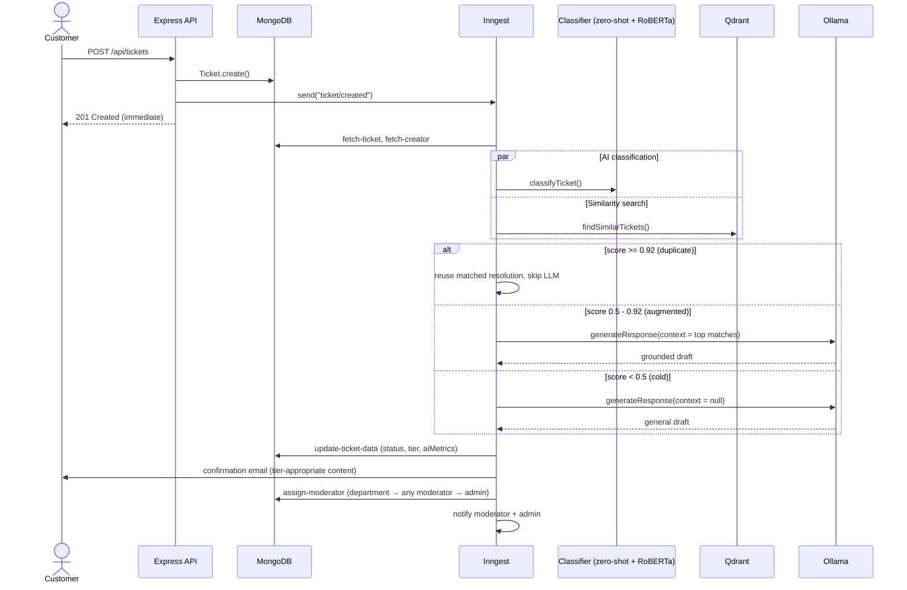
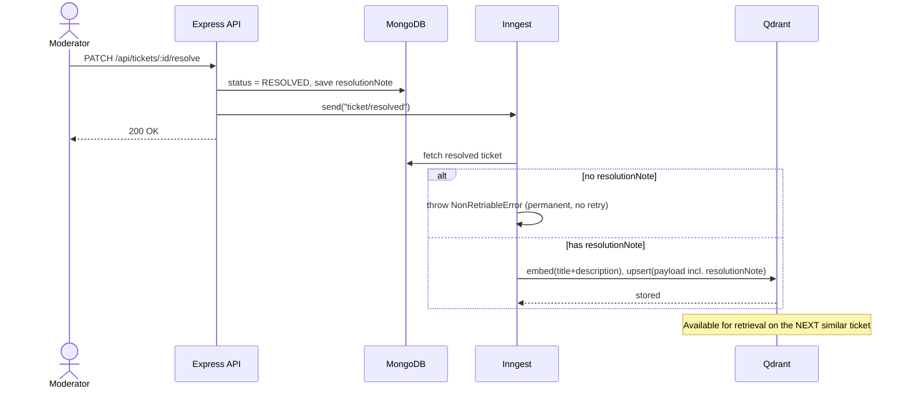
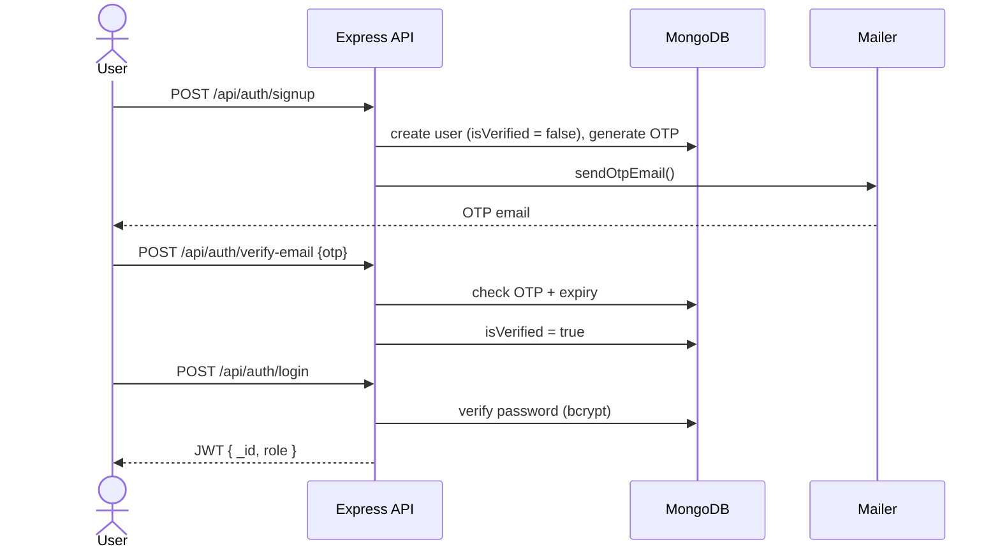

# Sequence Diagrams

Three flows only — the ones that cover the entire system end to end. Paste these into any
Mermaid-compatible renderer (GitHub markdown, Mermaid Live Editor, Notion, etc.) to generate
the images, or add exported PNGs directly into the README's screenshot placeholders.

---

## 1. Ticket Creation → AI Classification → Tiered Response

---

## 2. Ticket Resolution → Feeding the Knowledge Base

---

## 3. Signup → OTP Verification → Login

